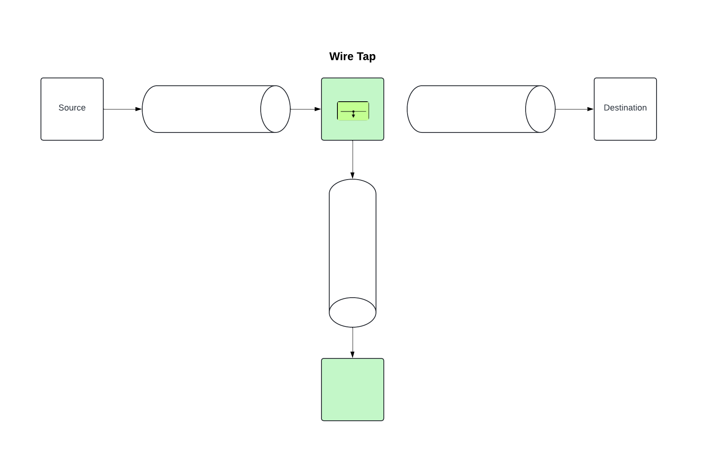
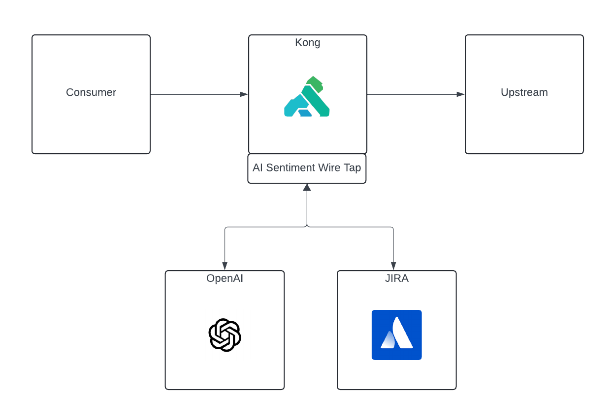

<p align="center" width="100%">
    
</p>

# Kong JIRA AI Sentiment Wire Tap plugin

## About
This Kong Plugin has been influenced by the Enterprise Integration Pattern called [Wire Tap](https://www.enterpriseintegrationpatterns.com/patterns/messaging/WireTap.html)

<p align="center" width="100%">
    
</p>

The plugin will take the request body, pass it to an OpenAI LLM to determine the sentiment of the text.
Based on the text's sentiment and plugin configuration, a JIRA issue will be created.

The sentiment of the request data will set the priority order of the JIRA issue.

## Use Case
A simple use case for this plugin is a company that has a system API that takes feedback or reviews from users.
Based on the response from these inputs they may want another team to contact the user more urgently based on the priority of the issue.
An additional JIRA issue will be created in the configured JIRA Project monitored by this team.

<p align="center" width="50%">
    
</p>

## Plugin configuration
```
llm_model
type = "string"
description = "OpenAI model to use to determine sentiment"
required = true
default = "gpt-3.5-turbo-instruct"

openai_token
type = "string"
description = "OpenAI Auth Token"
required = true

jira_token
type = "string"
description = "JIRA Cloud Auth Token"
required = true

jira_username
type = "string"
description = "JIRA Cloud username"
required = true

jira_cloud_domain
type = "string"
description = "Your JIRA Cloud company sub domain i.e. <domain>.atlassian.net"
required = true

jira_project
type = "string"
description = "JIRA Cloud project to create tickets"
required = true

jira_issue_type
type = "string"
description = "The issue type to create"
required = true
default = "Task"
one_of = { "Task", "Bug", "Story", "Epic" }

sentiment_trigger_level
type = "string"
description = "The sentiment level you wish wiretap to trigger"
required = true
default = "negative"
one_of = { "negative", "neutral", "ambivalent", "positive" }

debug
type = "boolean"
description = "Debug level for API calls"
required = true
```

## Installing the plugin

There are two things necessary to make a custom plugin work in Kong:

1. Load the plugin files.

The easiest way to install the plugin is using `luarocks`.

```sh
luarocks install https://github.com/QuadCorps/kong-plugin-jira-ai-sentiment-wiretap/raw/main/rocks/kong-plugin-jira-ai-sentiment-wiretap-0.1.0-1.all.rock
```

You can substitute `0.1.0-1` in the command above with any other version you want to install.

If running Kong using the Helm chart, you will need to create a config map with the plugin files and mount it to `/opt/kong/plugins/jira-ai-sentiment-wiretap`. You can read more about this on [Kong's website.](https://docs.konghq.com/kubernetes-ingress-controller/latest/guides/setting-up-custom-plugins/)

2. Specify that you want to use the plugin by modifying the plugins property in the Kong configuration.

Add the custom plugin’s name to the list of plugins in your Kong configuration:

```conf
plugins = bundled, jira-ai-sentiment-wiretap
```

If you are using the Kong helm chart, create a configMap with the plugin files and add it to your `values.yaml` file:

```yaml
# values.yaml
plugins:
  configMaps:
  - name: kong-plugin-jira-ai-sentiment-wiretap
    pluginName: jira-ai-sentiment-wiretap
```


